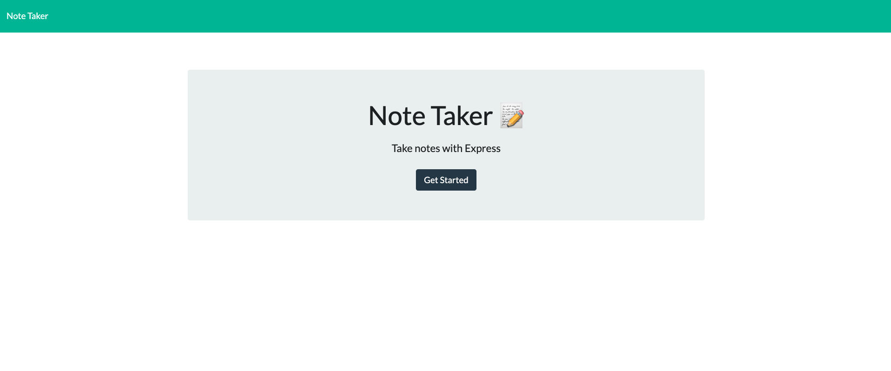
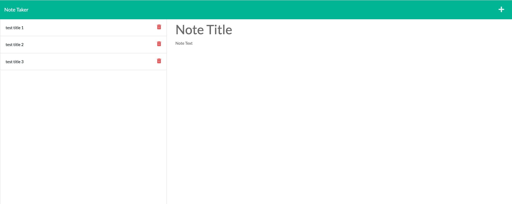
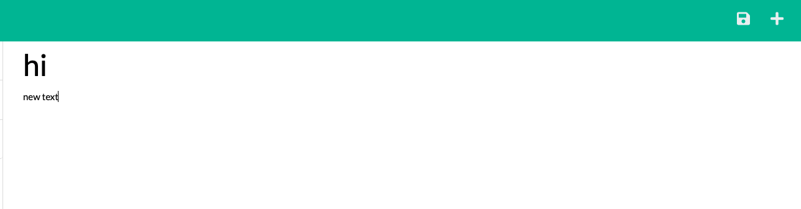
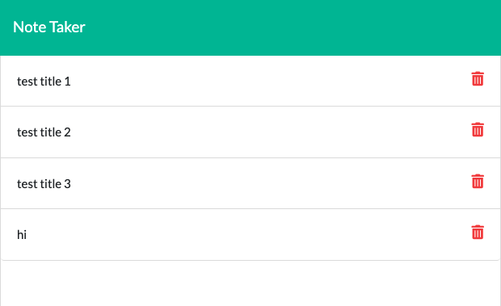

# note-taker

# employee-profile-generator

## Table of Contents

- [About this Project](#about-this-project)
- [Links to the Project](#Links-to-the-Project)
- [User Story](#User-Story)
- [Criteria](#Criteria)
- [Mock-Up](#Mock-Up)
- [Run the project](#Run-the-project)
- [File Structure](#File-Structure)
- [Technologies](#Technologies)
- [How To Contact Me](#How-To-Contact-Me)
- [Authored by](#Authored-by)

<br>

## About this Project

```
 This is an application called Note Taker that can be used to write and save notes. This application will use an Express.js back end and will save and retrieve note data from a JSON file. The entire application is been deployeed to Heroku.
```

<br>

## Links to the Project

Check out the Github Repository [Here](https://github.com/jinyiyu/note-taker)

Check out the deployed URL [Here](https://jinyiyu.github.io/my-personal-protfolio/)

<br>

## User Story

```md
AS A small business owner
I WANT to be able to write and save notes
SO THAT I can organize my thoughts and keep track of tasks I need to complete
```

## Criteria

```md
GIVEN a note-taking application
WHEN I open the Note Taker
THEN I am presented with a landing page with a link to a notes page
WHEN I click on the link to the notes page
THEN I am presented with a page with existing notes listed in the left-hand column, plus empty fields to enter a new note title and the note’s text in the right-hand column
WHEN I enter a new note title and the note’s text
THEN a Save icon appears in the navigation at the top of the page
WHEN I click on the Save icon
THEN the new note I have entered is saved and appears in the left-hand column with the other existing notes
WHEN I click on an existing note in the list in the left-hand column
THEN that note appears in the right-hand column
WHEN I click on the Write icon in the navigation at the top of the page
THEN I am presented with empty fields to enter a new note title and the note’s text in the right-hand column
```

<br />

## Mock-Up

The following images show the web application's appearance and functionality:

<details>
<summary> Starting Page</summary>



</details>

<details>
<summary> Note Page</summary>



</details>

<details>
<summary> add and Save New Note</summary>




</details>

<br />

## Run the project

The application will be invoked by using the following command:

```bash
git clone git@github.com:jinyiyu/note-taker.git
cd note-taker
npm init -y
```

Then a package.json file would pop up in your folder, click to enter the file, and change the script to :

```
"start":"node index.js"
```

Go to your terminal, install relevant dependency packages:

```
npm install express uuid
npm i nodemon -D
```

And run the project by following the instructions below:

```
npm run start
```

On the back end, the application should include a `db.json` file that will be used to store and retrieve notes using the `fs` module.

The following HTML routes should be created:

- `GET /notes` should return the `notes.html` file.

- `GET *` should return the `index.html` file.

The following API routes should be created:

- `GET /api/notes` should read the `db.json` file and return all saved notes as JSON.

- `POST /api/notes` should receive a new note to save on the request body, add it to the `db.json` file, and then return the new note to the client. You'll need to find a way to give each note a unique id when it's saved (look into npm packages that could do this for you).

<br>

## File Structure

please look at following chart for the directory structure:

```md
.
├── src
│ ├── controllers folder //notes.js and view.js end point
│ ├── routers // index.js and three other registered routes
│ ├── utils // utility functions stores in seperate files
│ ├── **index.js** // runs the application
├── public/ // rendered output (HTML), CSS style sheet and image
├── db/ // db.json
├── .gitignore // indicates which folders and files Git should ignore
├── READMD.md
└── package.json
```

<br>

## Technologies

- Node.js
- Express
- nodemon
- HTML
- CSS
- Javascript

<br>

## How To Contact Me

Please contact me if you have any inquiries

[](https://github.com/jinyiyu)
[](https://www.linkedin.com/in/jinyiyu/)
[](https://www.instagram.com/jinyiyu517/)
[](mailto:yujinyiicxk@gmail.com)

## Authored by

### **Jinyi Yu**
